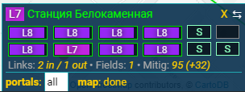

# Pocket Portal Details

### Deprecated, use the one from [ZasoItems.CE](https://github.com/MysticJay/ZasoItems.CE)

### [~~Install~~](https://github.com/Loskir/iitc-plugins/raw/master/pocket-portal-details/pocket-portal-details.user.js)

Shows pocket version of portal details on the bottom right / top center.

[Original version by Zaso](https://www.giacintogarcea.com/ingress/iitc/pocket-portal-details-by-zaso.user.js)

Changes:
- Added escapeHTML for title (fix layout breaks for portals whose names contain `"`)
- Added Aegis Shield support (instead of AXA)
- Refactored some code
